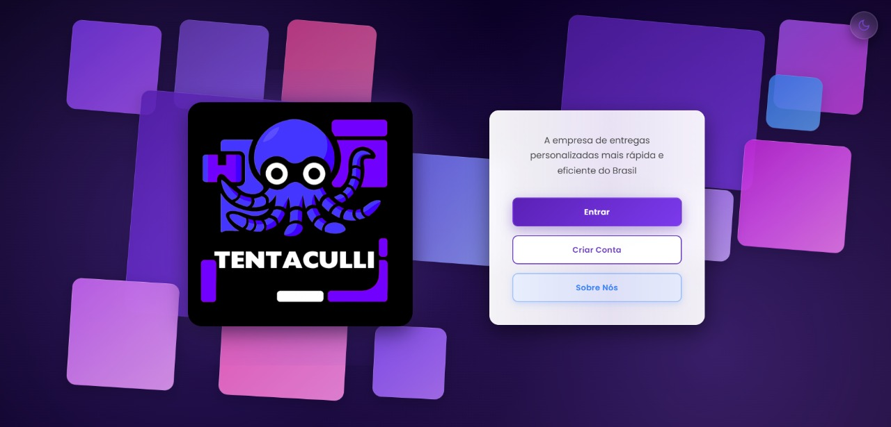
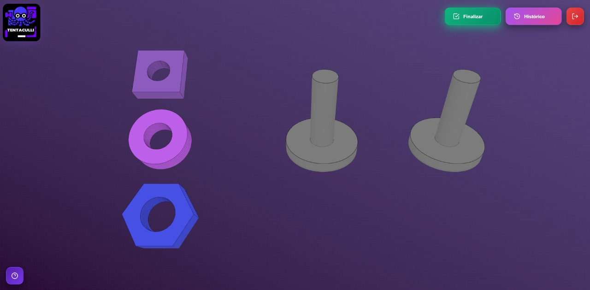
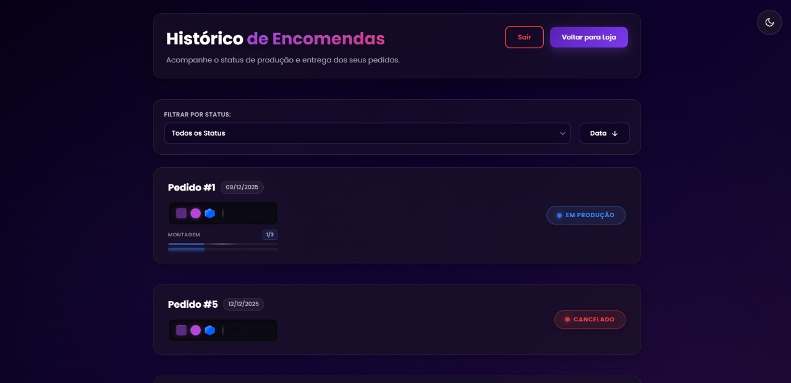
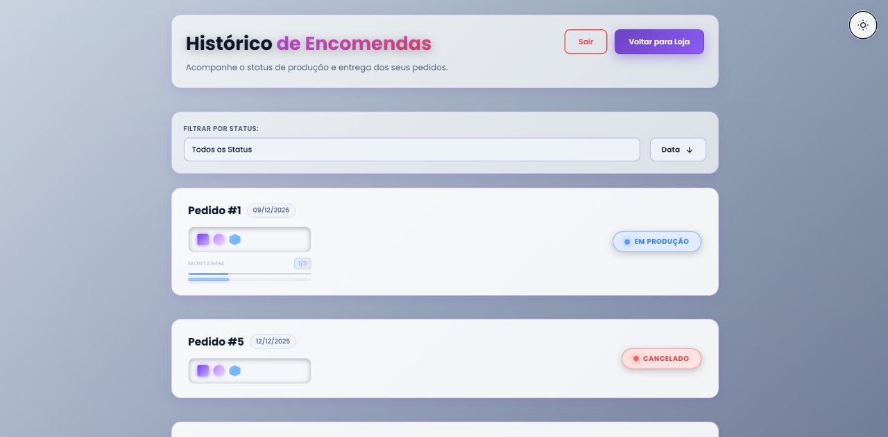
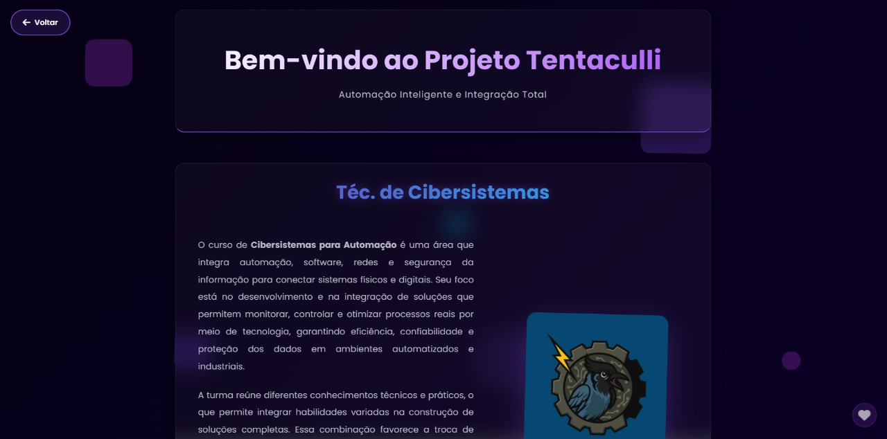

# Tentaculli System

Sistema de automação industrial integrado que conecta pedidos web a processos físicos de manufatura através de CLPs, robótica e comunicação industrial.

## Visão Geral

O Tentaculli é uma solução full-stack que permite aos clientes configurarem pedidos personalizados via interface web 3D. Esses pedidos são processados por uma API REST, armazenados em banco de dados MySQL e automaticamente traduzidos em comandos para CLPs industriais que controlam braços robóticos e sistemas de montagem.

## Screenshots

### Tela de Login

*Interface de autenticação com suporte a dark/light mode*

### Configurador 3D

*Ambiente 3D interativo para montagem de pedidos com drag-and-drop*

### Histórico de Pedidos

*Acompanhamento em tempo real do status de produção*


*Acompanhamento em tempo real do status de produção*

### Página de Apresentação

*Página institucional com informações sobre o projeto e equipe*

## Arquitetura

```
Web Interface (Three.js) → API REST (C#/.NET) → MySQL Database
                                ↓
                          Node-RED Middleware
                                ↓
                          CLP Siemens/Omron
                                ↓
                        Braço Robótico + Sensores
```

## Tecnologias

### Backend
- **C# / ASP.NET Core 8.0** - API REST
- **Entity Framework Core** - ORM
- **MySQL 8.0** - Banco de dados relacional
- **Swagger** - Documentação de API

### Frontend
- **Three.js** - Visualização 3D interativa
- **Vanilla JavaScript (ES6+)** - Lógica de aplicação
- **CSS3** - Estilização responsiva
- **HTML5** - Estrutura semântica

### Automação Industrial
- **Node-RED** - Middleware de comunicação
- **TIA Portal** - Programação de CLPs Siemens
- **OPC UA** - Protocolo de comunicação industrial
- **Omron Automation** - Hardware robótico

## Estrutura do Projeto

```
Tentaculli/
├── API/                          # Backend C#/.NET
│   ├── Controllers/              # Endpoints REST
│   │   ├── ClientController.cs   # Gerenciamento de clientes
│   │   └── OrderController.cs    # Gerenciamento de pedidos
│   ├── Models/                   # Entidades do domínio
│   ├── Data/                     # Contexto do banco de dados
│   ├── Migrations/               # Migrações EF Core
│   ├── Attributes/               # Validações customizadas
│   └── Program.cs                # Configuração da aplicação
│
└── ui/                           # Frontend
    └── src/
        ├── app/
        │   ├── login/            # Autenticação de usuários
        │   ├── order/            # Configurador 3D de pedidos
        │   ├── orders-history/   # Histórico e rastreamento
        │   └── presentation/     # Página de apresentação
        ├── services/
        │   └── api.js            # Cliente HTTP para API
        └── assets/               # Imagens e recursos estáticos
            └── screenshots/      # Screenshots do sistema
```

## Funcionalidades

### Para Clientes
- Cadastro e autenticação de usuários
- Configurador 3D drag-and-drop para montagem de pedidos
- Validação em tempo real de regras de negócio
- Histórico completo de pedidos com status ao vivo
- Rastreamento de progresso de produção
- Cancelamento de pedidos pendentes

### Para Administração
- API RESTful completa para integração
- Documentação Swagger interativa
- Controle de status de pedidos
- Auditoria de operações
- Sincronização em tempo real com linha de produção

## Instalação

### Pré-requisitos

- .NET 8.0 SDK
- MySQL 8.0+
- Node.js 18+ (para Node-RED)
- Visual Studio 2022 ou VS Code

### Configuração do Backend

1. Clone o repositório:
```bash
git clone https://github.com/seu-usuario/tentaculli.git
cd tentaculli/API
```

2. Configure a string de conexão em `appsettings.json`:
```json
{
  "ConnectionStrings": {
    "AppDbConnectionString": "Server=localhost;Database=tentaculli;User=root;Password=sua_senha;"
  }
}
```

3. Execute as migrações do banco de dados:
```bash
dotnet ef database update
```

4. Inicie a API:
```bash
dotnet run
```

A API estará disponível em `http://localhost:5150`

### Configuração do Frontend

1. Navegue até a pasta UI:
```bash
cd ../ui/src
```

2. Sirva os arquivos com um servidor HTTP local:
```bash
# Usando Python
python -m http.server 5500

# Ou usando Live Server do VS Code
```

3. Acesse `http://127.0.0.1:5500/app/login/login.html`

## Endpoints da API

### Clientes

```http
POST   /api/Client              # Cadastrar novo cliente
POST   /api/Client/login        # Autenticar cliente
GET    /api/Client              # Listar todos os clientes
GET    /api/Client/{id}         # Buscar cliente por ID
```

### Pedidos

```http
POST   /api/Order               # Criar novo pedido
GET    /api/Order               # Listar todos os pedidos
GET    /api/Order/{id}          # Buscar pedido por ID
GET    /api/Order/client/{id}   # Buscar pedidos por cliente
PUT    /api/Order/{id}/status   # Atualizar status do pedido
```

## Modelo de Dados

### Cliente
```csharp
{
  "id": int,
  "name": string,
  "email": string (unique),
  "password": string (hashed)
}
```

### Pedido
```csharp
{
  "id": int,
  "clientId": int,
  "pin1Pos1": int (1-3),  // 1=Círculo, 2=Quadrado, 3=Hexágono
  "pin1Pos2": int (1-3),
  "pin1Pos3": int (1-3),
  "pin2Pos1": int (1-3),
  "pin2Pos2": int (1-3),
  "pin2Pos3": int (1-3),
  "status": int,          // 1=Aguardando, 2=Produção, 3=Entregue, 4=Cancelado
  "statusByPosition": int, // Progresso de montagem (0-6)
  "created": datetime
}
```

## Regras de Negócio

1. **Configuração de Pedidos:**
   - Cada pino deve conter exatamente 3 peças OU estar vazio (0 peças)
   - Não são permitidas peças repetidas no mesmo pino
   - Tipos de peça: Círculo (1), Quadrado (2), Hexágono (3)

2. **Status de Pedidos:**
   - `Aguardando (1)`: Pedido na fila de produção
   - `Em Produção (2)`: Sendo montado pelo robô
   - `Finalizado (3)`: Pronto para entrega
   - `Cancelado (4)`: Cancelado pelo cliente

3. **Cancelamento:**
   - Apenas pedidos com status "Aguardando" podem ser cancelados
   - Cancelamentos são irreversíveis

## Validações Implementadas

- **Email único** por cliente
- **Senha mínima** de 6 caracteres
- **Peças duplicadas** no mesmo pino são bloqueadas
- **Pinos incompletos** (1 ou 2 peças) são rejeitados
- **Autenticação obrigatória** para criar pedidos

## Temas e Acessibilidade

O sistema suporta:
- Modo escuro (padrão)
- Modo claro
- Animações reduzidas para acessibilidade
- Design responsivo mobile-first
- Navegação por teclado

## Segurança

- Senhas armazenadas com hash
- Validação de dados no backend
- CORS configurado para origens específicas
- Sanitização de entradas do usuário
- Proteção contra injeção SQL via ORM

## Performance

- Lazy loading de imagens
- Animações otimizadas com `requestAnimationFrame`
- Queries SQL indexadas
- Cache de recursos estáticos
- Compressão gzip no servidor

## Desenvolvimento

### Scripts Disponíveis

```bash
# Backend
dotnet build                    # Compilar
dotnet test                     # Executar testes
dotnet ef migrations add Nome   # Criar migração
dotnet ef database update       # Aplicar migrações

# Documentação da API
# Acesse http://localhost:5150/swagger após iniciar a API
```

### Padrões de Código

- **Backend:** Convenções C# padrão (PascalCase)
- **Frontend:** ESLint + Prettier configurados
- **Commits:** Conventional Commits
- **Branches:** GitFlow

## Contribuidores

Projeto desenvolvido pela turma de Engenharia de Cibersistemas 2025:

- **Angelina Chaves** - Backend & Full-Stack
- **Carlos Matozo** - Brand Design & Frontend
- **Luan Ziscycki** - Comunicação Web-CLP
- **Lucas Moreira** - Frontend
- **Maria Bianchini** - CLP
- **Maria Lemes** - Automação Robótica
- **Victor Fidelis** - Comunicação Robô-CLP

## Licença

Este projeto é acadêmico e foi desenvolvido para fins educacionais.

## Suporte

Para questões relacionadas ao projeto:
- Abra uma issue no GitHub
- Entre em contato com a equipe via LinkedIn

---

**Tentaculli System** - Conectando o digital ao físico através da automação inteligente.